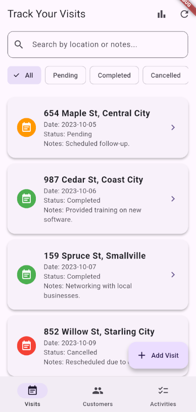
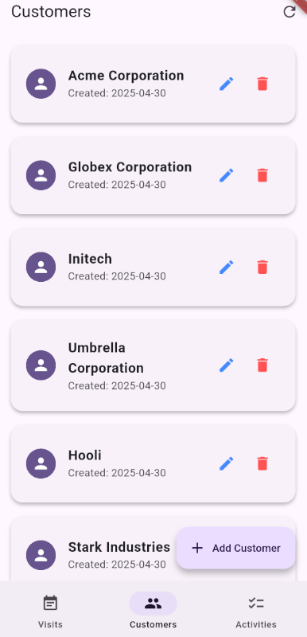
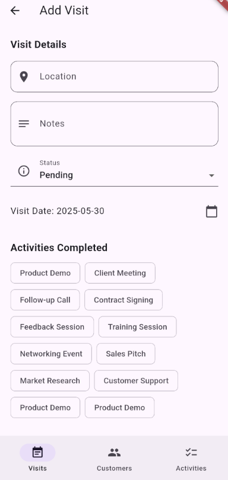

# Solutech Interview

## Overview
This Flutter application is a Visits Tracker designed for the Solutech interview challenge. It allows users to manage visits, customers, and activities, with support for offline usage and basic analytics. The app is built using Flutter, Provider for state management, Hive for local storage, and GoRouter for navigation.

---

## Key Architectural Choices
- **State Management:** Provider is used for simplicity and scalability.
- **Navigation:** GoRouter enables declarative, URL-based navigation and deep linking.
- **Offline Support:** Hive is used for local persistence. Visits can be created/edited offline and are synced when connectivity is restored.
- **Separation of Concerns:** Business logic is separated into providers and services, making the codebase modular and testable.
- **Testing:** Includes unit tests for models and providers, and widget tests for UI flows.
- **CI/CD:** GitHub Actions workflow runs tests and static analysis on every push/PR.

---

## Setup Instructions
1. **Clone the repository:**
   ```sh
   git clone https://github.com/Ivar-7/solutech_interview
   cd solutech_interview
   ```
2. **Install dependencies:**
   ```sh
   flutter pub get
   ```
3. **Run the app:**
   ```sh
   flutter run
   ```
4. **Run tests:**
   ```sh
   flutter test
   ```

---

## Offline Support
- Visits are stored locally using Hive when offline.
- Any visits created or edited offline are saved to a pending queue and automatically synced when the device is back online.
- The app detects connectivity changes using `connectivity_plus` and triggers syncs as needed.

---

## Testing
- Unit tests for models and providers are located in the `test/` directory.
- Widget and smoke tests ensure the main UI flows render and basic navigation works.
- To run all tests:
  ```sh
  flutter test
  ```

---

## CI/CD
- A GitHub Actions workflow (`.github/workflows/flutter_ci.yml`) is set up to run tests and static analysis on every push and pull request to `main`.
- This ensures code quality and prevents regressions.

---

## Features
- Add, edit, and delete visits
- Manage customers and activities
- Offline support for visits (create/edit offline, syncs when online)
- Search and filter visits
- Responsive UI for mobile and desktop
- Persistent local storage with Hive
- Modern navigation with GoRouter
- Simple analytics and summaries
- Basic error handling and feedback

---

## Screenshots




<!-- 

 -->

---

## Contact
For any questions or clarifications, please contact the author.

## License
This project is licensed under the MIT License. See the LICENSE file for details.

